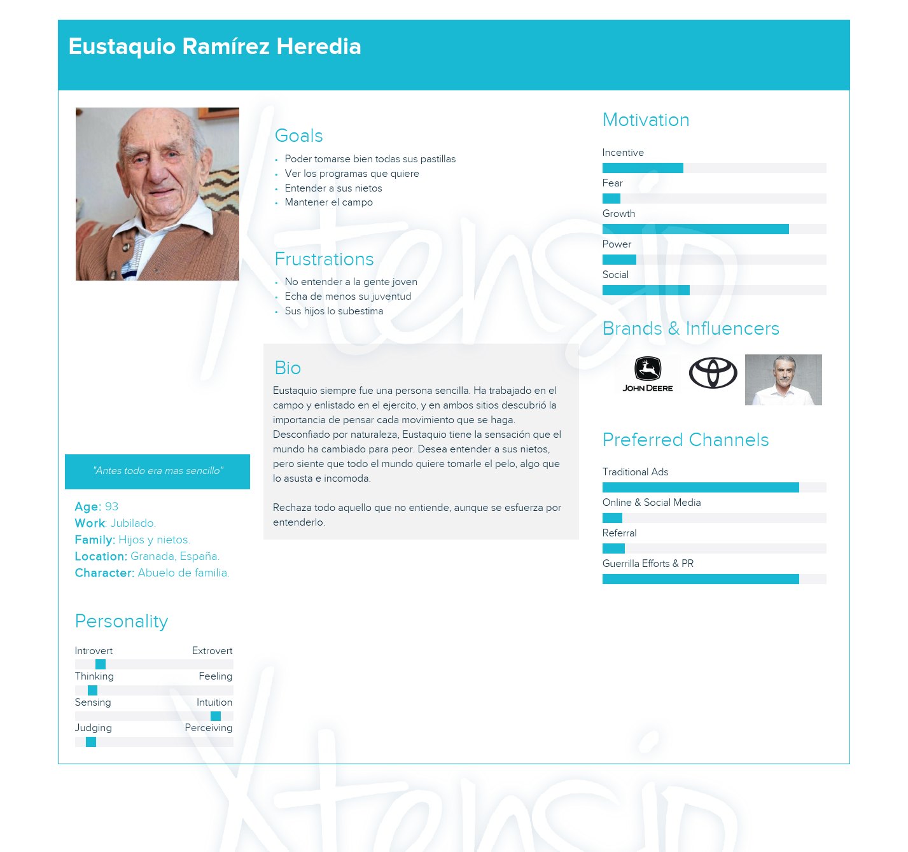
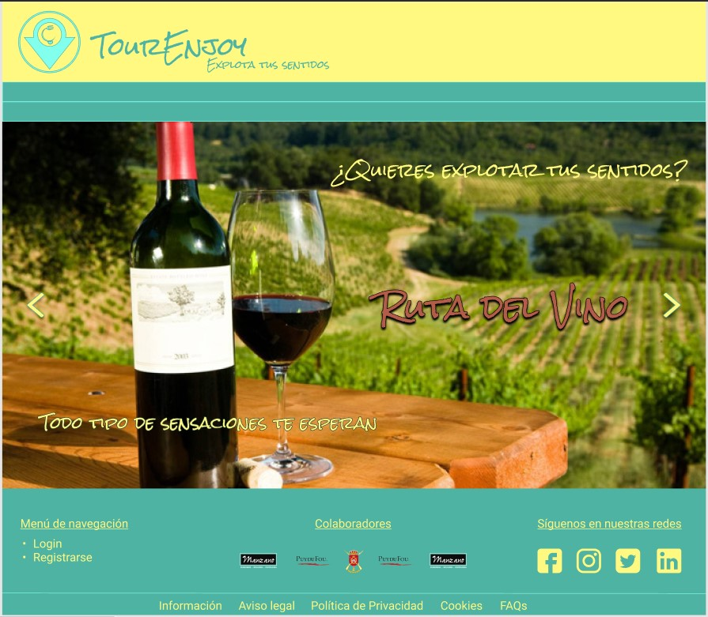

# DIU21
Prácticas Diseño Interfaces de Usuario 2020-21 (Tema: Turismo) 
prueba prueba prueba
Grupo: DIU3_RealBetisBP.  Curso: 2020/21 
Updated: 8/2/2021

Proyecto: 
>>> TourEnjoy 

Descripción: 

>>> Aplicación para compartir experiencias mediante tours

Logotipo: 
>>> 

Miembros
 * :bust_in_silhouette:   Jesús Ruiz Castellano     :octocat:     
 * :bust_in_silhouette:   David Pérez Núñez    :octocat:

----- 

# Proceso de Diseño 

## Paso 1. UX Desk Research & Analisis 

 1.a Competitive Analysis
-----

>>> Queremos crear una plataforma para realizar tours, tanto de manera presencial, como online. Hemos tomado como referencia Freetour, porque es una de las plataformas más usadas, y por otro lado, por su diseño, organizado, aunque algo cargado, y por la función de realizar tours online, que otras plataformas no incluyen, con la idea de seleccionar lo mejor de dicha plataforma, cambiar las partes más deficientes y añadir nuevas funcionalidades.
>>> 
>>> A continuación podemos ver el primer estudio comparativo de la plataforma que vamos a evaluar, con la plataforma CityTour Granada, una empresa de tours local :

>>> 

 1.b Persona
-----

>>> Como queremos ver distintos puntos de vista, hemos seleccionado 2 perfiles totalmente diferentes para así abarcar más casuísticas y escenarios diferentes :
>>> 
>>> 

 1.c User Journey Map
----

>>> Pensamos que la forma en la que interactúan con la aplicación los personajes toma caminos muy distintos, ofreciéndonos un enfoque más amplio al que tendríamos si pensamos en cómo usaría la aplicación alguien como nosotros:
>>> * :bust_in_silhouette: Olgui Ort
>>> 
>>> 
>>> 
>>> * :bust_in_silhouette: Eustaquio
>>> 
>>> 

 1.d Usability Review
----
>>> - Enlace al documento:  Este es el [enlace](https://github.com/Jesus715/DIU21/tree/master/P1/UsabilityReview.pdf) al documento.
>>> - Valoración final (numérica): 63 - Moderate
>>> - Comentario sobre la valoración:  Como hemos podido comprobar, la aplicación no está pensada para todos los públicos, siendo más difícil para personas con menor conocimiento tecnológico. 
>>> Los puntos más críticos que hemos encontrado han sido la navegación, que no era muy intuitivo saber dónde nos encontrábamos, y a la hora del pago, que se sale de la política de los tours presenciales, teniendo un precio predefinido, además de no ser un proceso sencillo.

## Paso 2. UX Design  

 2.a Feedback Capture Grid / EMpathy map / POV
----

>>> Una vez realizadas las entrevistas, la revisión de usabilidad y añadido nuestra perspectiva, hemos clasificado aspectos positivos actualmente existentes, críticas constructivas, preguntas de los usuarios (a partir de las personas ficticias), e ideas de mejora (a partir de la experiencia del equipo de desarrollo).
>>> 
#### Feedback Capture Grid 
>>> Aquí adjuntamos la **Malla receptora de información** resultante :
>>> 

#### Empathy Map
>>> Como queremos ver distintos puntos de vista, hemos seleccionado los mapas de ambos personajes :
>>> **Olgui Ort**
>>> 
>>> **Eustaquio**
>>> 

#### Point Of View
>>> Para esta sección hemos añadido un fichero *pdf* con los diferentes puntos de vista de ambos personajes. El fichero se llama [POV.pdf](https://github.com/Jesus715/DIU21/tree/master/P2/POV.pdf)

 2.b ScopeCanvas
----
>>> **Propuesta de valor. Descripción :** Vamos a diseñar una aplicación para compartir diferentes experiencias a través de tours que se van a proponer en la plataforma, ya sea por parte de los usuarios cliente, como de los usuarios comerciantes.
>>> A continuación adjuntamos el **LeanUX Canvas** :
>>> 

 2.c Tasks analysis 
-----

>>> **User/Task Matrix :**
>>> Hemos escogido esta opción, porque nos parece que hace un mejor resumen visual de grupos y tareas, y deja más claras las partes críticas en función de los distintos tipos de usuario :
>>> 
>>> 

 2.c IA: Sitemap + Labelling 
----

>>> Como ya tenemos diferenciadas las tareas principales, ahora hay que desarrollar el ***Sitemap***. Para ello, hemos tenido en cuenta la dificultad para acceder a algunos menús y opciones de *freetour*, para así mejorar la experiencia de usuario:
>>> 
>>> 
>>> 
>>> Con el siguiente ***Labelling*** vamos a explicar las funcionalidades y distintas páginas mencionadas en el ***Sitemap*** :
>>> 
>>> 

 2.d Wireframes
-----

>>> Estos son los diferentes ***bocetos Lo-Fi*** que hemos diseñado, aplicando las ideas de mejora obtenidas del estudio hecho previamente de usabilidad, haciendo destacar la claridad y la simplicidad para el usuario. Los diseños están agrupados de 3 o de 4 en 4 :
>>> 
>>>  
>>> 
>>>  
>>>  
>>>  
>>>  
>>>  
>>> 
>>>  
>>> 
>>>  
>>> 
>>> Para verlos de manera individual y así poder verlos más detalladamente, puede acceder al subdirectorio en el que se encuentran alojados a través de [este enlace](https://github.com/Jesus715/DIU21/tree/master/P2/wireframes)
>>> 
>>> **Valoración :** 
>>> Tras finalizar esta parte nos hemos dado cuenta de cómo acercarnos más al usuario para poder hacer un diseño más específico y cómodo para él. 

## Paso 3. Mi UX-Case Study (diseño)

 3.a Moodboard
-----

>>> **MOODBOARD**
>>>  
>>> 
>>> **LOGOTIPO**
>>> 
>>> 
>>> Para el diseño del logotipo hemos utilizado la herramienta web Canva y hemos mezclado elementos que creemos llamativos y, a su vez, intuitivos para identificar a nuestra aplicación de manera inequívoca.

  3.b Landing Page
----

>>>  

 3.c Guidelines
----

>>> **Estudio de Guidelines y Patrones IU a usar**
>>> 
*BUSCAR*
Search/results: tenemos una barra de búsqueda, y los resultados se van a apareciendo automáticamente

*NAVEGACIÓN*
Piramidal: tenemos una pagina de inicio (inicio) de la cual derivan otras 5 (registrarse, iniciar sesión,
perfil, tours, y productos). De esas paginas derivan otras, haciéndose en forma de pirámide.

*INFORMACIÓN*
List Inlay: muestra como una lista los tours disponibles, y los que tiene contratados el cliente
Gallery: los tour son un conjunto de imágenes con un texto asociado y una opción de compra.

*ASISTENTES / WIZARDS*
Migas de pan: Se ha usado una barra de navegación encima de la información, la cual muestra el path
de dicha pagina. Ademas se dispone de herramientas para la navegación adicionales en el footer.

*REGISTRAR*
Sign In / Account Registration: patrón clásico de inicio de sesión y registro, formulario a completar

*DATOS DE USUARIO*
Formulario relleno: Es un formulario lleno con los datos del usuario y fácilmente modificable. Para
completar la acción de modificación debes darle a guardar. 

  3.d Mockup
----

>>> Layout: Mockup / prototipo HTML  (que permita simular tareas con estilo de IU seleccionado)
>>> 
>>> 
>>> 
>>> Para verlos de manera individual y así poder verlos más detalladamente, puede acceder al subdirectorio en el que se encuentran alojados a través de [este enlace](https://github.com/Jesus715/DIU21/tree/master/P3/mockups)

 3.e ¿My UX-Case Study?
-----

>>> **My Case Study**
>>> A continuación, adjuntamos un vídeo-demostración de lo que sería la navegación de un usuario, *NomUsuario*, desde que entra al Landing page, se registra, se apunta a un Tour, consulta y modifica sus datos personales, ve los tours disponibles, y visita la página de política de privacidad :
>>> 
>>> 
https://user-images.githubusercontent.com/17532503/117972421-6c7c8e80-b32b-11eb-942c-4c6870058f4a.mp4

## Paso 4. Evaluación 

 4.a Caso asignado
----

>>> Para esta práctica se nos han asignado los grupos :
>>> 
>>> **DIU1.Piña**, que podemos ver a través del enlace a su [repositorio de GitHub](https://github.com/pablojj1808/DIU21)
>>> y
>>> **DIU2.TheThruster**, que podemos ver a través del enlace a su [repositorio de GitHub](https://github.com/AlejandroFrndz/DIU)

 4.b User Testing
----

>>> Los lanzamientos de los dados han dado los siguientes resultados :

| Tiradas/Dados | Tipos     | Actividad   |  Emociones   
| ------------- | -------- | ----------- | ----
| 1ª  |  3 | 3  | 4   
| 2ª  |  5 | 5  | 6
| 3ª  |  5 | 1  | 1
| 4ª  |  6 | 4  | 2
 
 
 >>> En base a las tiradas de los dados, hemos buscado a personas de nuestro entorno que pudiesen entrar dentro de las características sacadas.

>>> Nos hemos percatado que las tiradas primera y cuartas se pueden corresponder con los personajes ficticios que se realizaron al principio de la asignatura, siendo estos: Olgui Ort y Eustaquio Ramirez. Ambos personajes basados en personas de nuestro entorno cercano, por lo que se les ha asignado a dichos avatares el rol de usuario.
Los otros dos usuarios están basados en gente que hemos conocido, no tan cercanos como los primeros. Estos tienen oficios muy diferentes y edades distintas, y por ello ofrecen puntos de vista muy distintos.

>>> El principal motivo de la elección de estas personas es que conforman un rango sumamente amplio en cuanto a la aproximación del usuario a la tecnología, siendo esta aproximación de menor a mayo: el anciano con conocimientos nulos, la mujer con conocimiento justo, la joven con el conocimiento generacional y el profesor con un conocimiento exhaustivo.
El segundo motivo de selección es la edad, ya que esta puede condicionar la experiencia de usuario en tanto y cuando la capacidad física se vea comprometida de alguna forma, siendo el ejemplo más claro es el del octogenario.

| Usuarios | Sexo/Edad     | Ocupación   |  Exp.TIC    | Personalidad | Plataforma | TestA/B
| ------------- | -------- | ----------- | ----------- | -----------  | ---------- | ----
| #USER1  | H / 93   | Jubilado  | Ninguna       | Introvertido | Web       | A 
| #USER2  | M / 22   | Bailarina  | Media       | Extrovertida       | Web        | A 
| #USER3  | M / 27   | Dependiente     | Baja        | Emocional    | web      | B 
| #USER4  | H / 50   | Matemático  | Alta       | Racional     | Web        | B 

. 4.c Cuestionario SUS
----

>>> Usaremos el **Cuestionario SUS** para valorar la satisfacción de cada usuario con el diseño (A/B) realizado. Para ello usamos la hoja de cálculo, para calcular resultados sigiendo las pautas para usar la escala SUS e interpretar los resultados.

>>> A continuación, adjuntamos el pdf con el cuestionario y el resultado obtenido :
>>> [Cuestionario SUS](https://github.com/Jesus715/DIU21/tree/master/P4/Cuestionario_SUS.pdf)

 4.d Usability Report
----

>> En este apartado se encuentra el enlace correspondiente al *Informe de Usabilidad* de la aplicación B de nuestro caso:

>>> **DIU1.Piña**
>>>
>>> [Usability Report : DIU1.Piña](https://github.com/Jesus715/DIU21/P4/P4_UsabReport_Piña_doneby_DIU3_RealBetisBP.pdf)

## Paso 5. Evaluación de Accesibilidad  

  5.a Accesibility evaluation Report 
----

>>> Indica qué pretendes evaluar (de accesibilidad) sobre qué APP y qué resultados has obtenido 

>>> 5.a) Evaluación de la Accesibilidad (con simuladores o verificación de WACG) 
>>> 5.b) Uso de simuladores de accesibilidad 

>>> (uso de tabla de datos, indicar herramientas usadas) 

>>> 5.c Breve resumen del estudio de accesibilidad (de práctica 1) y puntos fuertes y de mejora de los criterios de accesibilidad de tu diseño propuesto en Práctica 4.

## Conclusión final / Valoración de las prácticas

>>> (90-150 palabras) Opinión del proceso de desarrollo de diseño siguiendo metodología UX y valoración (positiva /negativa) de los resultados obtenidos  

