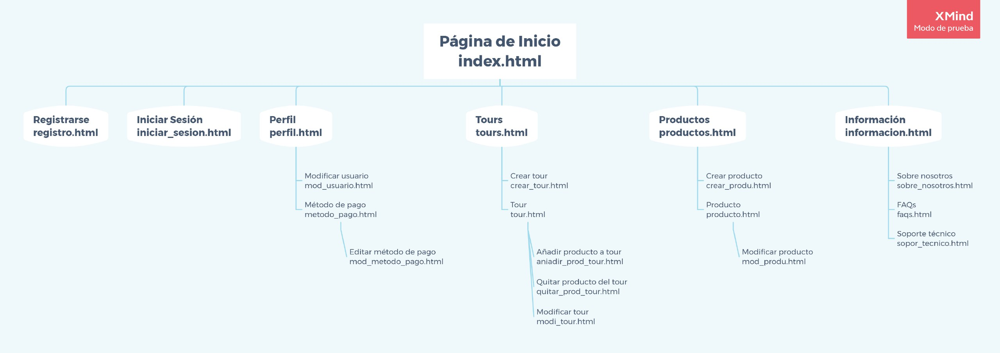
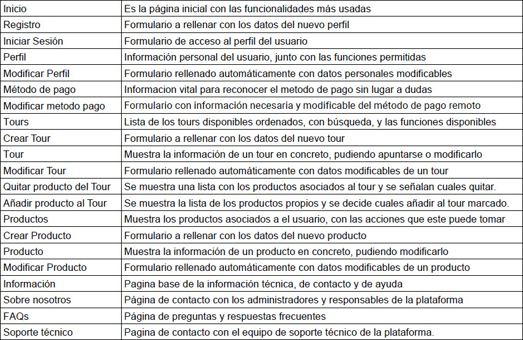

# DIU21
Prácticas Diseño Interfaces de Usuario 2020-21 (Tema: Turismo) 
prueba prueba prueba
Grupo: DIU3_RealBetisBP.  Curso: 2020/21 
Updated: 8/2/2021

Proyecto: 
>>> TourEnjoy 

Descripción: 

>>> Aplicación para compartir experiencias mediante tours

Logotipo: 
>>> Opcionalmente si diseña un logotipo para su producto en la práctica 3 pongalo aqui

Miembros
 * :bust_in_silhouette:   Jesús Ruiz Castellano     :octocat:     
 * :bust_in_silhouette:   David Pérez Núñez    :octocat:

----- 

# Proceso de Diseño 

## Paso 1. UX Desk Research & Analisis 

 1.a Competitive Analysis
-----

>>> Queremos crear una plataforma para realizar tours, tanto de manera presencial, como online. Hemos tomado como referencia Freetour, porque es una de las plataformas más usadas, y por otro lado, por su diseño, organizado, aunque algo cargado, y por la función de realizar tours online, que otras plataformas no incluyen, con la idea de seleccionar lo mejor de dicha plataforma, cambiar las partes más deficientes y añadir nuevas funcionalidades.
>>> 
>>> A continuación podemos ver el primer estudio comparativo de la plataforma que vamos a evaluar, con la plataforma CityTour Granada, una empresa de tours local :

>>> 

 1.b Persona
-----

>>> Como queremos ver distintos puntos de vista, hemos seleccionado 2 perfiles totalmente diferentes para así abarcar más casuísticas y escenarios diferentes :
>>> 
>>> 

 1.c User Journey Map
----

>>> Pensamos que la forma en la que interactúan con la aplicación los personajes toma caminos muy distintos, ofreciéndonos un enfoque más amplio al que tendríamos si pensamos en cómo usaría la aplicación alguien como nosotros:
>>> * :bust_in_silhouette: Olgui Ort
>>> 
>>> 
>>> 
>>> * :bust_in_silhouette: Eustaquio
>>> 
>>> 

 1.d Usability Review
----
>>> - Enlace al documento:  Este es el [enlace](https://github.com/Jesus715/DIU21/tree/master/P1/UsabilityReview.pdf) al documento.
>>> - Valoración final (numérica): 63 - Moderate
>>> - Comentario sobre la valoración:  Como hemos podido comprobar, la aplicación no está pensada para todos los públicos, siendo más difícil para personas con menor conocimiento tecnológico. 
>>> Los puntos más críticos que hemos encontrado han sido la navegación, que no era muy intuitivo saber dónde nos encontrábamos, y a la hora del pago, que se sale de la política de los tours presenciales, teniendo un precio predefinido, además de no ser un proceso sencillo.

## Paso 2. UX Design  

 2.a Feedback Capture Grid / EMpathy map / POV
----

>>> Una vez realizadas las entrevistas, la revisión de usabilidad y añadido nuestra perspectiva, hemos clasificado aspectos positivos actualmente existentes, críticas constructivas, preguntas de los usuarios (a partir de las personas ficticias), e ideas de mejora (a partir de la experiencia del equipo de desarrollo).
>>> 
#### Feedback Capture Grid 
>>> Aquí adjuntamos la **Malla receptora de información** resultante :
>>> 

#### Empathy Map
>>> Como queremos ver distintos puntos de vista, hemos seleccionado los mapas de ambos personajes :
>>> **Olgui Ort**
>>> 
>>> **Eustaquio**
>>> 

#### Point Of View
>>> Para esta sección hemos añadido un fichero *pdf* con los diferentes puntos de vista de ambos personajes. El fichero se llama [POV.pdf](https://github.com/Jesus715/DIU21/tree/master/P2/POV.pdf)

 2.b ScopeCanvas
----
>>> **Propuesta de valor. Descripción :** Vamos a diseñar una aplicación para compartir diferentes experiencias a través de tours que se van a proponer en la plataforma, ya sea por parte de los usuarios cliente, como de los usuarios comerciantes.
>>> A continuación adjuntamos el **LeanUX Canvas** :
>>> 

 2.c Tasks analysis 
-----

>>> **User/Task Matrix :**
>>> Hemos escogido esta opción, porque nos parece que hace un mejor resumen visual de grupos y tareas, y deja más claras las partes críticas en función de los distintos tipos de usuario :
>>> 
>>> 

 2.c IA: Sitemap + Labelling 
----

>>> Como ya tenemos diferenciadas las tareas principales, ahora hay que desarrollar el ***Sitemap***. Para ello, hemos tenido en cuenta la dificultad para acceder a algunos menús y opciones de *freetour*, para así mejorar la experiencia de usuario:
>>> 
>>> 
>>> 
>>> Con el siguiente ***Labelling*** vamos a explicar las funcionalidades y distintas páginas mencionadas en el ***Sitemap*** :
>>> 
>>> 

 2.d Wireframes
-----

>>> Estos son los diferentes ***bocetos Lo-Fi*** que hemos diseñado, aplicando las ideas de mejora obtenidas del estudio hecho previamente de usabilidad, haciendo destacar la claridad y la simplicidad para el usuario. Los diseños están agrupados de 3 o de 4 en 4 :
>>> 
>>>  
>>> 
>>>  
>>>  
>>>  
>>>  
>>>  
>>> 
>>>  
>>> 
>>>  
>>> 
>>> Para verlos de manera individual y así poder verlos más detalladamente, puede acceder al subdirectorio en el que se encuentran alojados a través de [este enlace](https://github.com/Jesus715/DIU21/tree/master/P2/wireframes)
>>> 
>>> **Valoración :** 
>>> Tras finalizar esta parte nos hemos dado cuenta de cómo acercarnos más al usuario para poder hacer un diseño más específico y cómodo para él. 

## Paso 3. Mi UX-Case Study (diseño)

 3.a Moodboard
-----

>>> Plantear Diseño visual con una guía de estilos visual (moodboard) 
>>> Incluir Logotipo
>>> Si diseña un logotipo, explique la herramienta utilizada y la resolución empleada. ¿Puede usar esta imagen como cabecera de Twitter, por ejemplo, o necesita otra?

  3.b Landing Page
----

>>> Plantear Landing Page 

 3.c Guidelines
----

>>> Estudio de Guidelines y Patrones IU a usar 
>>> Tras documentarse, muestre las deciones tomadas sobre Patrones IU a usar para la fase siguiente de prototipado. 

  3.d Mockup
----

>>> Layout: Mockup / prototipo HTML  (que permita simular tareas con estilo de IU seleccionado)

 3.e ¿My UX-Case Study?
-----

>>> Publicar my Case Study en Github..
>>> Documente y resuma el diseño de su producto en forma de video de 90 segundos aprox

## Paso 4. Evaluación 

 4.a Caso asignado
----

>>> Breve descripción del caso asignado con enlace a  su repositorio Github

 4.b User Testing
----

>>> Seleccione 4 personas ficticias. Exprese las ideas de posibles situaciones conflictivas de esa persona en las propuestas evaluadas. Asigne dos a Caso A y 2 al caso B
 

| Usuarios | Sexo/Edad     | Ocupación   |  Exp.TIC    | Personalidad | Plataforma | TestA/B
| ------------- | -------- | ----------- | ----------- | -----------  | ---------- | ----
| User1's name  | H / 18   | Estudiante  | Media       | Introvertido | Web.       | A 
| User2's name  | H / 18   | Estudiante  | Media       | Timido       | Web        | A 
| User3's name  | M / 35   | Abogado     | Baja        | Emocional    | móvil      | B 
| User4's name  | H / 18   | Estudiante  | Media       | Racional     | Web        | B 

. 4.c Cuestionario SUS
----

>>> Usaremos el **Cuestionario SUS** para valorar la satisfacción de cada usuario con el diseño (A/B) realizado. Para ello usamos la [hoja de cálculo](https://github.com/mgea/DIU19/blob/master/Cuestionario%20SUS%20DIU.xlsx) para calcular resultados sigiendo las pautas para usar la escala SUS e interpretar los resultados
http://usabilitygeek.com/how-to-use-the-system-usability-scale-sus-to-evaluate-the-usability-of-your-website/)
Para más información, consultar aquí sobre la [metodología SUS](https://cui.unige.ch/isi/icle-wiki/_media/ipm:test-suschapt.pdf)

>>> Adjuntar captura de imagen con los resultados + Valoración personal 

 4.d Usability Report
----

>> Añadir report de usabilidad para práctica B (la de los compañeros)

>>> Valoración personal 

## Paso 5. Evaluación de Accesibilidad  

  5.a Accesibility evaluation Report 
----

>>> Indica qué pretendes evaluar (de accesibilidad) sobre qué APP y qué resultados has obtenido 

>>> 5.a) Evaluación de la Accesibilidad (con simuladores o verificación de WACG) 
>>> 5.b) Uso de simuladores de accesibilidad 

>>> (uso de tabla de datos, indicar herramientas usadas) 

>>> 5.c Breve resumen del estudio de accesibilidad (de práctica 1) y puntos fuertes y de mejora de los criterios de accesibilidad de tu diseño propuesto en Práctica 4.

## Conclusión final / Valoración de las prácticas

>>> (90-150 palabras) Opinión del proceso de desarrollo de diseño siguiendo metodología UX y valoración (positiva /negativa) de los resultados obtenidos  

